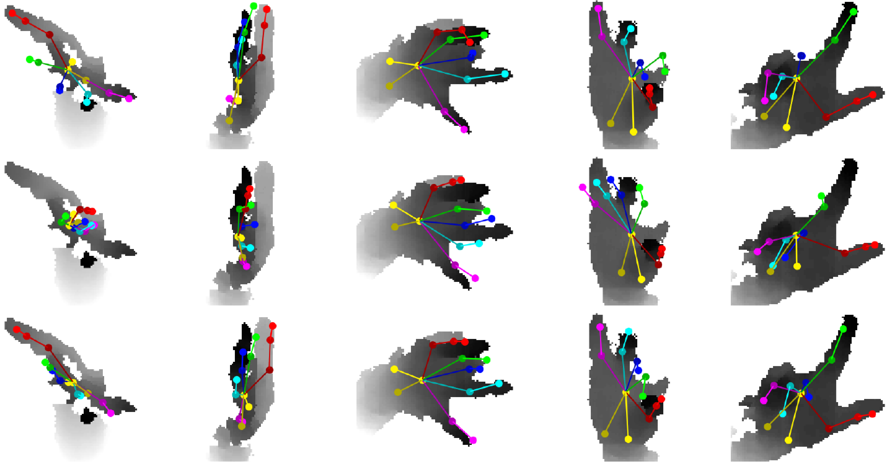
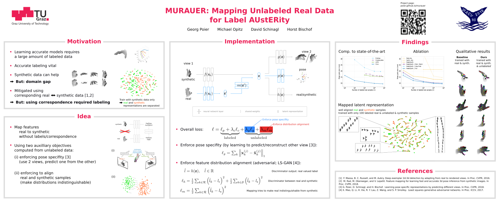

<p>
<center><a href="https://poier.github.io">Georg Poier</a>&nbsp;&nbsp;&nbsp;&nbsp;&nbsp;
<a href="https://www.tugraz.at/institute/icg/research/team-bischof/lrs/people/opitz">Michael Opitz</a>&nbsp;&nbsp;&nbsp;&nbsp;&nbsp;
<a href="https://www.tugraz.at/institute/icg/research/team-bischof/lrs/people/schinagl">David Schinagl</a>&nbsp;&nbsp;&nbsp;&nbsp;&nbsp;
<a href="https://www.tugraz.at/institute/icg/research/team-bischof/people/team-about/horst-bischof">Horst Bischof</a></center>
</p>

<p>
<center>Graz University of Technology</center>  
<center>Austria</center>
</p>

<p>
<center>In WACV 2019</center>
</p>

<p>
<center>
<a href="https://ieeexplore.ieee.org/document/8658723">[Paper]</a>&nbsp;&nbsp;&nbsp;&nbsp;
<a href="./documents/poier2019wacv_poster.pdf">[Poster]</a>&nbsp;&nbsp;&nbsp;&nbsp;
<a href="https://github.com/poier/murauer">[Code]</a>&nbsp;&nbsp;&nbsp;&nbsp;
</center>
</p>

---

  
We introduce a method to exploit unlabeled data, which improves results 
especially for highly distorted images and difficult poses. 
**Top:** ground truth. **Middle:** baseline trained with labeled data (synthetic and 100 real). 
**Bottom:** our result from training with the same labeled data and additional unlabeled real data.

---

## Abstract
Data labeling for learning 3D hand pose estimation models is a huge effort. 
Readily available, accurately labeled synthetic data has the potential to reduce the effort. 
However, to successfully exploit synthetic data, current state-of-the-art methods 
still require a large amount of labeled real data. 
In this work, we remove this requirement by learning to map from the features of 
real data to the features of synthetic data mainly using a large amount of 
synthetic and *unlabeled* real data. We exploit unlabeled data using two auxiliary objectives, 
which enforce that (i) the mapped representation is pose specific and (ii) at the same time, 
the distributions of real and synthetic data are aligned. 
While pose specifity is enforced by a self-supervisory signal requiring that 
the representation is predictive for the appearance from different views, 
distributions are aligned by an adversarial term. 
In this way, we can significantly improve the results of the baseline system, 
which does not use unlabeled data and outperform many recent approaches already 
with about 1% of the labeled real data. 
This presents a step towards faster deployment of learning based hand pose estimation, 
making it accessible for a larger range of applications.

---

## Paper

MURAUER: Mapping Unlabeled Real Data for Label AUstERity.  
In WACV 2019.  
<a href="https://ieeexplore.ieee.org/document/8658723">[Paper (IEEE Xplore; original IEEE publication)]</a>
<a href="https://arxiv.org/abs/1811.09497">[Paper & Supp. (arXiv)]</a>

<a href="https://arxiv.org/abs/1811.09497">
</a>

[[Paper as webpage]](https://www.arxiv-vanity.com/papers/1811.09497/) provided by 
arxiv-vanity.com. 
Not perfect (e.g., some figures are assembled wrongly) 
but probably still easier to read on some devices.

---

## Poster

<a href="./documents/poier2019wacv_poster.pdf">[Poster]</a> presented at WACV 2019.  

<a href="./documents/poier2019wacv_poster.pdf">
</a>

---

## Code

[[Code]](https://github.com/poier/murauer) at github  

<a href="https://github.com/poier/murauer">
</a>

---

## Results

Below you find text files with predicted joint positions for the NYU dataset 
(for different numbers of labeled real samples, *n*, used for training).

*n* 	| Joint positions (uvd) | Joint positions (xyz) | Mean error (mm)
---: | --- | --- | ---: 
10  	| [*n*10-uvd](https://github.com/poier/murauer/tree/master/results/joint_pos_murauer_n10_wacv_uvd.txt) | [*n*10-xyz](https://github.com/poier/murauer/tree/master/results/joint_pos_murauer_n10_wacv_xyz.txt) | 16.4
100  	| [*n*100-uvd](https://github.com/poier/murauer/tree/master/results/joint_pos_murauer_n100_wacv_uvd.txt) | [*n*100-xyz](https://github.com/poier/murauer/tree/master/results/joint_pos_murauer_n100_wacv_xyz.txt) | 12.2
1,000  	| [*n*1k-uvd](https://github.com/poier/murauer/tree/master/results/joint_pos_murauer_n1000_wacv_uvd.txt) | [*n*1k-xyz](https://github.com/poier/murauer/tree/master/results/joint_pos_murauer_n1000_wacv_xyz.txt) | 10.9
10,000  | [*n*10k-uvd](https://github.com/poier/murauer/tree/master/results/joint_pos_murauer_n10000_wacv_uvd.txt) | [*n*10k-xyz](https://github.com/poier/murauer/tree/master/results/joint_pos_murauer_n10000_wacv_xyz.txt) | 9.9
72,757  | [*n*73k-uvd](https://github.com/poier/murauer/tree/master/results/joint_pos_murauer_n72757_wacv_uvd.txt) | [*n*73k-xyz](https://github.com/poier/murauer/tree/master/results/joint_pos_murauer_n72757_wacv_xyz.txt) | 9.5

---

## Citation
If you can make use of this work, please cite:

MURAUER: Mapping Unlabeled Real Data for Label AUstERity.  
Georg Poier, Michael Opitz, David Schinagl and Horst Bischof.  
In *Proc. WACV*, 2019.

Bibtex:
```
@inproceedings{Poier2019wacv_murauer,  
  author = {Georg Poier and Michael Opitz and David Schinagl and Horst Bischof},  
  title = {{MURAUER}: Mapping Unlabeled Real Data for Label AUstERity},  
  booktitle = {{Proc. IEEE Winter Conf. on Applications of Computer Vision (WACV)}},  
  year = {2019}
}
```

---

## Acknowledgements
We thank the anonymous reviewers for their effort and valuable feedback, and
Markus Oberweger for his feedback regarding their implementation of 
[[Feature Mapping]](https://arxiv.org/abs/1712.03904).


